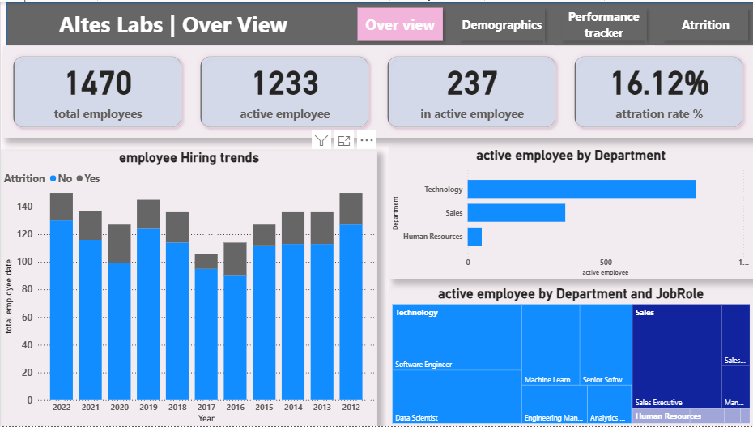
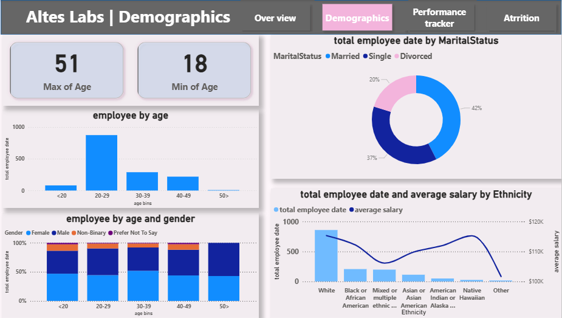
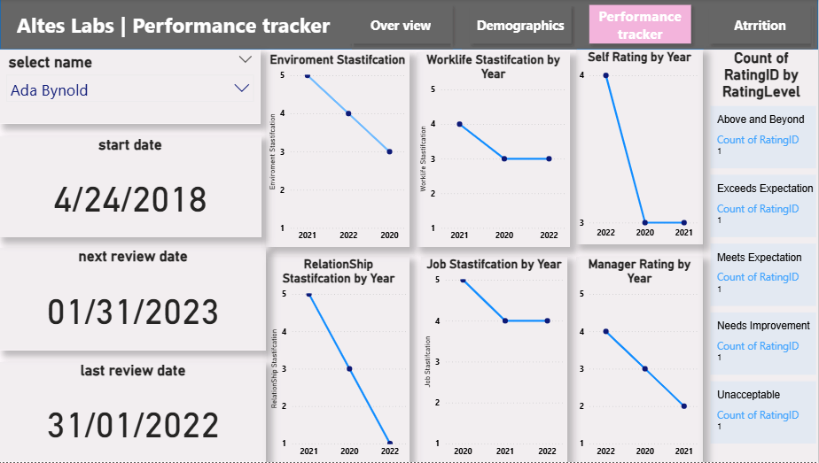
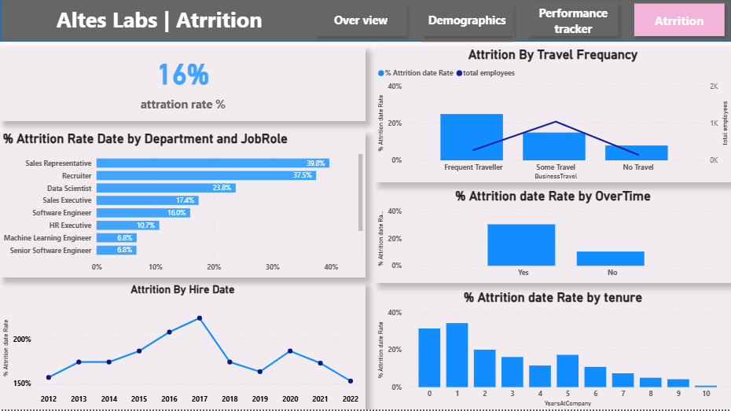

# 📊 HR Analytics Dashboard | Employee Attrition & Performance

---

## 🚀 Overview
This project is an **interactive HR Analytics Dashboard** built using Power BI to analyze employee data with a focus on **attrition, performance, and workforce demographics**.

It helps HR teams:
- Understand employee behavior  
- Identify attrition patterns  
- Improve retention strategies  
- Support data-driven HR decisions  

---

## 📌 Dashboard Pages
This project includes **4 interactive dashboard pages**:

### 🏠 1. Overview
- High-level KPIs (Total Employees, Attrition Rate, etc.)
- General workforce summary

### 👥 2. Demographics
- Age distribution  
- Gender and marital status analysis  
- Employee background insights  

### 📈 3. Performance Tracker
- Performance ratings over time  
- Manager feedback analysis  
- Job satisfaction trends  

### 🚪 4. Attrition
- Attrition rate breakdown  
- Attrition by department, role, tenure  
- Business travel vs attrition insights  

---

## 🛠 Tools & Technologies
- Power BI  
- Microsoft Excel / CSV  

---

## 💡 Key Insights
- Certain departments and job roles show **higher attrition rates**, indicating workload or satisfaction issues  
- Employees with **low job satisfaction and poor environment rating** are more likely to leave  
- Attrition is higher in **early tenure years**, highlighting the importance of onboarding  
- Performance is strongly influenced by **manager feedback and satisfaction levels**

---

## 📁 Dataset Structure
The project contains multiple datasets used for analysis:

- employees.csv → Employee demographic information  
- attrition.csv → Employee attrition records  
- performance.csv → Employee performance data  

All datasets were cleaned, structured, and prepared before analysis.

---

## 🎯 Business Impact
- Improve HR decision-making  
- Reduce employee attrition  
- Optimize workforce planning  
- Enhance employee engagement strategies  

---

## 📸 Dashboard Preview

### 🏠 Overview

### 👥 Demographics

### 📈 Performance Tracker

### 🚪 Attrition

---

## 📂 Project Structure
HR-Analytics-Dashboard/
│
├── dashboard.pbix
├── data/
│   ├── employees.csv
│   ├── attrition.csv
│   └── performance.csv
│
├── HR-Analytics/
│   └── Images/
│       ├── overview.png
│       ├── demographics.png
│       ├── performancetracker.png
│       └── attrition.png
│
└── README.md

---

## ⭐ How to Use
1. Download the `.pbix` file  
2. Open it in Power BI Desktop  
3. Navigate between the 4 dashboard pages  

---

## 📢 Author
**Ahmed Saber**
